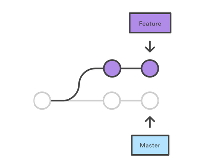

<!-- $theme: default -->

PAPW2
===

##### Alberto Benavides
###### Ene - Jun 2019

<!-- footer: Universidad Autónoma de Nuevo León | Facultad de Ciencias Físico Matemáticas | Multimedia y Animación Digital -->

---

# Forma de evaluación

---

# Lista de correos

* Enviar correo por Nexus
* Contacto: jose.benavidesvz@uanl.edu.mx

---

# Laravel

	Love beautiful code? We do too. (Laravel)

* Framework (marco de trabajo, en español) PHP
* Conjunto de programas que permiten crear una apliación web

<center></center>

---

# Requisitos
Para instalar Laravel es necesario contar en el equipo con

* [Git](https://git-scm.com/): Software de control de versiones
* [Composer](https://getcomposer.org/): Para manipulación de dependencias de PHP

---

# Control de versiones

* Software registra cambios en el código 
* Permite hacer pruebas sin comprometer el trabajo de producción. 
* Facilita el trabajo en equipo.

---

# Control de versiones y Fotografía

Pasos | Fotografía | Control de versiones
--|--|--
1 |Encuadras al objeto | Preparas los archivos (*stage*)
2 |Tomas una foto |Haces un *commit*
3 |La guardar en un álbum | Se almacena en un repositorio

---

# Representación como grafos

<center></center>

<center></center>

---

# Git

Softwares control de versiones

<center></center>

---

# Instalación git

1. bajar y ejecutarel instalador;
2. abrir un terminal (Símbolo de sistema); e
3. insertar el código

```
git config --global user.name "Nombre Apellido" 
git config --global user.email usuario@correo.com
```

---

# Comandos de consola

```
rem Muestra el contenido de un directorio
dir

rem Cambia de directorio
cd directorio

rem Cambia al directorio superior
cd ..

rem Crea una carpeta en la ubicación actual
mkdir nombreCarpeta
```

---

# Comandos Git

```
rem Inicia un repositorio en la ubicación actual
git init

rem Muestra el estado del repositorio
git status

rem Prepara todos los archivos y directorios
git add .

rem Hace un commit con los cambios preparados
git commit -m "Mensaje"

rem Muestra los commits realizados
git log
```

---

# Revertir cambios

```
rem Muestra cambios en archivos preparados y no preparados
git diff

rem Deshace los cambios del archivo preparado (*staged*)
git reset HEAD archivo.extensión

rem Revierte los cambios no preparados del archivo
git checkout archivo.extensión
```

---

# Repositorios remotos

```
rem Añade repositorio remoto
git remote add nombre url

rem Clona repositorio remoto
git clone url

rem Muestra repositorios remotos
git remote -v

rem Desvincula repositorio remoto
gir remote rm nombre

rem Envía actualizaciones al repositorio remoto
git push remoto rama
```

---

# `.gitignore`

* Especifica archivos y carpetas a ignorar por los commits
* Se coloca generalmente en la carpeta raíz del proyecto

---

# Ejemplo creación de repositorio

---

# Ejercicio
###### 8 correctas: +2 primer parcial
###### 1 a 7 correctas: +1 primer parcial

1. Anota tu matrícula en una hoja en blanco
3. Responder las siguientes preguntas

---

## 1. Qué etiqueta HTML se utiliza para incluir el archivo externo `main.js` localizado dentro de la carpeta `public`.

---

## 2. ¿Qué orden de prioridad (mayor a menor prioridad) tienen los estilos CSS?
a) Desde el nombre de la clase, desde el nombre del identificador.
b) Desde archivo externo, como atributo de una etiqueta.
c) Como atributo de una etiqueta, desde archivo externo.
d) En el encabezado de la página, desde archivo externo.

---

## 3. ¿Qué orden, de más externo a más interno, tienen los elementos del modelo de cajas de los elementos HTML?

---

## 4. En CSS, ¿cómo harías referencia a la acción de pasar por encima de un enlace que es el primer hijo de una lista que pertenece a una lista desordenada con identificador `listas`, perteneciente a un elemento con identificador `principal`, contenido en un `div`?

---

## 5. Método que permite el envío de valores a través de variables en la URL.

---

## 6. Método preferido para el envío de valores asociados a variables sin restricción de longitud de datos.

---

## 7. ¿Qué objeto de una aplicación web corresponde a una tabla de una base de datos?

---

## 8. ¿Qué objeto de una aplicación web se encarga generalmente de mapear las rutas, recibir las peticiones y devolver las respuestas por parte del servidor?

---

# Revisión

1. Cambia tu hoja con algún compañero
2. Evalúa

---

# Instalación de Laravel

## Opción 1
```
composer global require laravel/installer

rem Ubicarse en la carpeta del proyecto

laravel new nombre
```

## Opción 2

```cmd
rem ^ se utiliza para continuar instrucción en otro línea

composer create-project ^
--prefer-dist laravel/laravel nombre
```

---

# Servidor local

1. Ejecutar
```
php artisan serve
```
2. Abrir http://localhost:8000
3. *Voilà !*

---

# Carpetas principales

* `app`: Contiene los modelos de la aplicación
* `config`: Agrupa las configuraciones de la aplicación
* `database`: Engloba los objetos de la base de datos
	* `migrations`: Especificación de tablas
	* `seeds`: Registros predeterminados de tablas
* `public`: Carpeta principal del proyecto
	* `css`, `js`: Archivos de estilo y códigos de Javascript
	* `index.php`: Llegada de peticiones de usuarios

---

# Carpetas principales (cont.)

* `resources`: Almacena ciertos recursos
	* `lang`: Los idiomas instalados
	* `views`: Las vistas (páginas) de la aplicación
* `routes/web.php`: Contiene las redirecciones de la aplicación
* `storage`: Almacena los archivos generados en cada sesión
* `storage/app/public`: Almacenar archivos generados usuarios

---

# Variables de entorno

* `.env.example`: Ejemplo de variables de entorno
	* Seguridad
	* Acceso a base de datos
	* Servidor de correo
* `.env`: Variables de entorno
* `.gitignore`: Excluir `.env`

---

# LLave de la aplicación

Si en `.env` no existe valor para `APP_KEY`:
```
php artisan key:generate
```

---

# Configuración de la aplicación

* `.env`
* `config`
* `config/app.php`: Idioma en `'locale' => 'en'`

## Acceder a variables de configuración

```
// Recupera valor de app.php/locale
config('app.locale');

// Establece valores
config(['variable' => 'nuevoValor']);
```

---

# Modo mantenimiento

```
rem Entrar a modo mantenimiento
php artisan down

rem Entrar a modo mantenimiento con mensaje
php artisan down --message="Mensaje informativo"

rem Entrar a modo mantenimiento con excepción de 127.0.0.1
php artisan down --allow=127.0.0.1

rem Salir del modo mantenimiento
php artisan up
```

---

# Paquete de [Laravel en español](https://github.com/Laraveles/spanish)

1. Ejecutar
```
composer require laraveles/spanish
```

2. Añadir en `config/app.php`
```
'providers' => [
    Laraveles\Spanish\SpanishServiceProvider::class,
];
```
3. Ejecutar
```
php artisan laraveles:install-lang
```

4. Elegir el idioma español en `config/app.php`
```
'locale' => 'es',
```

---

# Hospedaje en [Heroku](http://heroku.com)

* Servicio de hospedaje 
* PaaS: Sin necesidad de que el usuario configure un servidor o red, como en AWS
	* *Platform as a Service*
	* Plataforma como servicio 
* Integrado con Git: Despliega el último *commit* **correcto**

---

# Instalación de Laravel en Heroku

1. Crear cuenta en Heroku
2. instalar Heroku CLI
3. Crear proyecto de Laravel
4. Crear repositorio en carpeta del proyecto
5. Especificar en Heroku que public será la carpeta inicial
```
echo web: vendor/bin/heroku-php-apache2 public/ Procfile
git add .
git commit -m "Procfile for Heroku"
```
6. Crear una aplicación en Heroku
```
heroku create
```

---

# Instalación de Laravel en Heroku (cont.)


* Cambiar el nombre de la aplicación
```
heroku apps:rename nuevoNombre
```
7. Establecer una llave de aplicación
```
php artisan key:generate --show
heroku config:set APP_KEY=[La llave]
```

8. Publicar en Heroku
```git
git push heroku master
```
9. Abrir aplicación
```
heroku open
```

---

# Vincular Heroku con GitHub

1. Dashboard de Heroku
2. Pestaña Deploy
3. Elegir GitHub en Deployment method
4. Especificar la cuenta y repositorio de GitHub en Connect to GitHub

---

# Colaboración en Heroku

```
rem Conceder acceso
heroku access:add usuario@correo.com

rem Quitar acceso
heroku access:remove usuario@correo.com
```
## [Actualizar](https://stackoverflow.com/a/36395204) el proyecto tras clonar
```
composer update --no-scripts
```

---

# Base de datos en Heroku: JawsDB

1. Ejecuta
```
heroku addons:create jawsdb:kitefin
```
2. Dashboard de Heroku
3. Pestaña Resources
4. JawsDB MySQL
5. Ejecuta
```
heroku config:set DB_CONNECTION=mysql
heroku config:set DB_DATABASE=[JawsBD]
heroku config:set DB_HOST=[JawsDB]
heroku config:set DB_PASSWORD=[JawsDB]
heroku config:set DB_USERNAME=[JawsDB]
```
6. Añade las mismas configuraciones en el archivo `.env`

---

# Conexión a la base de datos desde consola

## Programas
* [XAMPP](https://www.apachefriends.org/es/index.html)
* [MySQL Workbench](https://www.mysql.com/products/workbench/)

```
mysql -u nombreUsuario -pcontraseña -h host
```

```
// Muestra bases de datos
show databases;

// Establece una base de datos
use nombre;
```

---

# Otros alojamiento web

* Recomendación
	* [000webhost](https://www.000webhost.com/forum/t/deploy-laravel-project-into-000webhost-site/127323)
    * [FreeSQLdatabase](http://www.freesqldatabase.com/)

1. Renombrar `public` a `public_html`
2. `app/Providers/AppServiceProvider.php`
``` 
// Cambiar
return base_path('public');

// Por
return base_path('public_path');
```

---

# Otros alojamiento web (cont.)

3. `server.php`
```
// Cambiar
if ($uri !== '/' && file_exists(__DIR__.'/public'.$uri)) {
  returnfalse;
}
require_once __DIR__.'/public/index.php';

// Por
if ($uri !== '/' && 
	file_exists(__DIR__.'/public_html'.$uri)){
  returnfalse;
}
require_once __DIR__.'/public_html/index.php';
```

---

# Tarea 1
###### +2 primer parcial
###### Límite: 29 enero 2019; 6:00am

1. Crea una aplicación de Laravel,
2. Especifica variables de configuración
3. Hospédala en un repositorio público de GitHub
4. Crea una aplicación de Heroku (u otro servicio) y vincúlala con tu repositorio de GitHub
5. Implementa una base de datos en línea
6. Añade el correo bena.87@hotmail.com como colaborador

---

# Tarea 1 (cont.)


7. Envía un correo con asunto **PAPW2 [Matrícula]** a jose.benavidesvz@uanl.edu.mx con la siguente información en el cuerpo del mensaje:

* Temática del proyecto: 
* Necesidades que resuelve: 
* Usuarios a los que va dirigida: 
* URL de GitHub: 
* URL de la aplicación: 